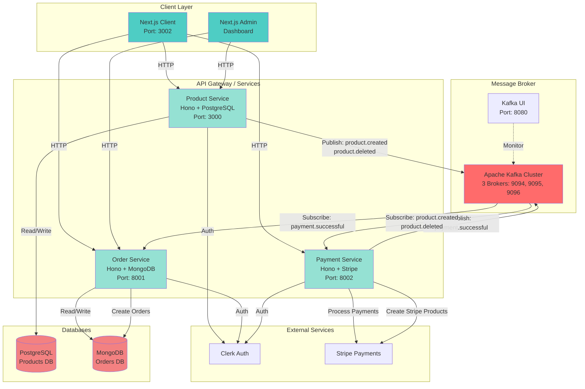

# E-Commerce Microservices Platform

[](#)
[](#)
[](#)
[](#)
[](#)
[](#)
[](#)
[](#)
[](#)
[](#)

A modern, scalable e-commerce platform built with a microservices architecture using Turborepo, Bun, and Next.js, with event-driven communication via Apache Kafka.


## Architecture Overview

This monorepo contains a complete e-commerce solution with separate services for products, orders, and payments, along with a Next.js client application and admin dashboard. Services communicate asynchronously using Apache Kafka for event-driven architecture.



## Event-Driven Communication

Services communicate asynchronously using Apache Kafka for loose coupling and scalability:

### Kafka Topics

| Topic                | Publisher       | Subscriber(s)   | Purpose                               |
| -------------------- | --------------- | --------------- | ------------------------------------- |
| `product.created`    | Product Service | Payment Service | Sync new products to Stripe           |
| `product.deleted`    | Product Service | Payment Service | Remove products from Stripe           |
| `payment.successful` | Payment Service | Order Service   | Create order after successful payment |

### Message Flow Examples

**1. Product Creation Flow:**

```
Admin Dashboard → Product Service → Kafka (product.created) → Payment Service → Stripe
```

**2. Checkout Flow:**

```
Client → Payment Service → Stripe Checkout → Stripe Webhook
       → Payment Service → Kafka (payment.successful) → Order Service → MongoDB
```

**3. Product Deletion Flow:**

```
Admin Dashboard → Product Service → Kafka (product.deleted) → Payment Service → Stripe
```

### Applications

- **`client`** - Next.js 15 storefront with Stripe checkout integration
- **`admin`** - Next.js 15 admin dashboard for managing products, orders, and users
- **`product-service`** - Product catalog and inventory management API (Hono + PostgreSQL)
- **`order-service`** - Order processing and management API (Hono + MongoDB)
- **`payment-service`** - Stripe payment processing API (Hono + Stripe)

### Shared Packages

- **`@repo/kafka`** - Type-safe Kafka producer/consumer wrapper (KafkaJS)
- **`@repo/product-db`** - Prisma client for PostgreSQL product database
- **`@repo/order-db`** - Mongoose models for MongoDB order database
- **`@repo/typescript-config`** - Shared TypeScript configurations
- **`@repo/eslint-config`** - Shared ESLint configurations

## Tech Stack

- **Runtime**: [Bun](https://bun.sh) - Fast JavaScript runtime
- **Framework**: [Hono](https://hono.dev) - Lightweight web framework for services
- **Frontend**: [Next.js 15](https://nextjs.org) - React framework with App Router
- **Message Broker**: [Apache Kafka](https://kafka.apache.org/) - Event streaming platform
- **Kafka Client**: [KafkaJS](https://kafka.js.org/) - Modern Kafka client for Node.js
- **Databases**: PostgreSQL (Products), MongoDB (Orders)
- **ORM**: Prisma (PostgreSQL), Mongoose (MongoDB)
- **Authentication**: [Clerk](https://clerk.com)
- **Payments**: [Stripe](https://stripe.com)
- **Monorepo**: [Turborepo](https://turbo.build/repo)

## Prerequisites

- [Bun](https://bun.sh) >= 1.0
- [Node.js](https://nodejs.org) >= 18 (for Next.js)
- [Docker](https://www.docker.com/) (for Kafka)
- PostgreSQL database
- MongoDB database
- Clerk account
- Stripe account

## Getting Started

### Quick Start with Makefile

```bash
# Complete setup (install deps, start Kafka, setup databases)
make setup

# Start all services
make quick-start

# View all available commands
make help
```

### Manual Setup

### 1. Install Dependencies

```bash
bun install
```

### 2. Environment Setup

Copy `.env.example` to `.env` in the root directory:

```bash
cp .env.example .env
```

**Only 2 Services Require API Keys:**

```env
# Clerk Authentication (Get from https://clerk.com)
CLERK_PUBLISHABLE_KEY=pk_test_...
CLERK_SECRET_KEY=sk_test_...

# Stripe Payment (Get from https://stripe.com)
STRIPE_SECRET_KEY=sk_test_...
STRIPE_PUBLISHABLE_KEY=pk_test_...
STRIPE_WEBHOOK_SECRET=whsec_...
NEXT_PUBLIC_STRIPE_PUBLISHABLE_KEY=pk_test_...
```

**Everything Else Has Smart Defaults:**

All other configuration has sensible defaults in `.env.example`:
- ✅ **Database URLs**: `localhost:5432` (PostgreSQL), `localhost:27017` (MongoDB)
- ✅ **Kafka Brokers**: `localhost:9094,9095,9096` (for local dev)
- ✅ **Service URLs**: `https://api.localhost` (via Traefik)

**Docker Compose automatically overrides these for containers** using the `${VAR:-default}` syntax, so the same `.env` works for both local and Docker development.

### 3. Start Infrastructure with Docker Compose

The easiest way to get started is using Docker Compose which includes Traefik reverse proxy, Kafka cluster, databases, and all services:

```bash
# Build and start all services
make docker-up-build

# Or manually:
docker compose up -d --build
```

**Access Points:**
- **Traefik Dashboard**: https://dashboard.localhost (admin/admin)
- **Client App**: https://shop.localhost
- **Admin App**: https://admin.localhost
- **Product API**: https://api.localhost/products
- **Order API**: https://api.localhost/api/orders
- **Payment API**: https://api.localhost/api/session
- **Kafka UI**: http://localhost:8080

**Note**: All HTTP traffic auto-redirects to HTTPS via Traefik v3.6

### 4. Alternative: Local Development (Services on Host)

If you prefer running services locally outside Docker:

**Start Infrastructure Only:**
```bash
# Start Traefik, Kafka, PostgreSQL, MongoDB
make docker-infra-only
```

**Run Prisma Migrations:**
```bash
cd packages/product-db
bun run db:migrate
bun run db:generate
```

**Start Services:**

```bash
# Start all services with Turborepo
make dev

# Or start individual services
make dev-client      # Client (port 3002)
make dev-admin       # Admin (port 3003)
make dev-product     # Product service (port 3000)
make dev-order       # Order service (port 8001)
make dev-payment     # Payment service (port 8002)
```

### 5. Verify Kafka Integration

**Check Producer/Consumer Status:**

All microservices automatically initialize Kafka producers and consumers on startup:

- ✅ **Product Service**: Producer only (publishes `product.created`, `product.deleted`)
- ✅ **Order Service**: Producer + Consumer (consumes `payment.successful`)
- ✅ **Payment Service**: Producer + Consumer (consumes `product.created`, `product.deleted`, publishes `payment.successful`)

**Monitor Kafka:**
```bash
# Open Kafka UI
make kafka-ui

# View Kafka logs
make docker-logs-traefik
docker compose logs -f kafka-broker-1

# Check topics
docker exec -it kafka-broker-1 /opt/kafka/bin/kafka-topics.sh --bootstrap-server localhost:9092 --list
```

## Service Architecture Details

### Producer/Consumer Initialization

#### Product Service
```typescript
// apps/product-service/src/index.ts
producer.start()  // ✅ Start producer on initialization
```
- **Producer**: ✅ Started on app initialization
- **Events Published**: 
  - `product.created` - When new product is created
  - `product.deleted` - When product is deleted
- **Consumer**: ❌ Not needed (doesn't subscribe to any topics)

#### Order Service
```typescript
// apps/order-service/src/index.ts
connectOrderDB()
  .then(() => producer.start())        // ✅ Start producer
  .then(() => runKafkaSubscriptions()) // ✅ Start consumer
```
- **Producer**: ✅ Started after DB connection
- **Consumer Topics**: `payment.successful`
- **Handler**: Creates order in MongoDB after successful payment

#### Payment Service  
```typescript
// apps/payment-service/src/index.ts
producer.start()
  .then(() => runKafkaSubscriptions()) // ✅ Start consumer & producer
```
- **Producer**: ✅ Started on app initialization
- **Consumer Topics**: `product.created`, `product.deleted`
- **Handlers**: Sync products to/from Stripe
- **Events Published**: `payment.successful` - After Stripe webhook confirms payment

### Kafka Configuration

The `@repo/kafka` package automatically reads broker configuration from environment:

```typescript
// packages/kafka/src/client.ts
const brokers = process.env.KAFKA_BROKERS?.split(',') || [
  "localhost:9094",  // Default for local development
  "localhost:9095",
  "localhost:9096",
];
```

**Environment-based Broker Selection:**
- **Local Dev** (services on host): `KAFKA_BROKERS=localhost:9094,localhost:9095,localhost:9096`
- **Docker** (services in containers): `KAFKA_BROKERS=kafka-broker-1:9092,kafka-broker-2:9092,kafka-broker-3:9092`

### Available Commands

#### Development

```bash
make dev              # Start all services with Turborepo
make dev-client       # Client only (port 3002)
make dev-admin        # Admin only (port 3003)  
make dev-product      # Product service (port 3000)
make dev-order        # Order service (port 8001)
make dev-payment      # Payment service (port 8002)
```

#### Docker

```bash
make docker-up              # Start all services
make docker-up-build        # Build and start all services
make docker-down            # Stop all services
make docker-down-volumes    # Stop and remove volumes
make docker-logs            # View all logs
make docker-logs-traefik    # View Traefik logs
make docker-logs-product    # View product service logs
make docker-infra-only      # Start only infrastructure (Traefik, DB, Kafka)
```

#### Traefik & Kafka

```bash
make traefik-dashboard   # Open Traefik dashboard (https://dashboard.localhost)
make kafka-ui            # Open Kafka UI (http://localhost:8080)
make status              # Show service status and URLs
```

#### Database

```bash
make db-migrate      # Run Prisma migrations
make db-generate     # Generate Prisma client
make db-studio       # Open Prisma Studio
```

#### Code Quality

```bash
make lint            # Run ESLint
make type-check      # Run TypeScript type checking
make format          # Format code with Prettier
make test            # Run tests
make build           # Build all applications
```

## Makefile Commands

This project includes a comprehensive Makefile for easy management. Run `make help` to see all available commands.
| `make type-check`  | Run TypeScript type checking                    |
| `make build`       | Build all applications                          |
| `make status`      | Show status of all services                     |
| `make clean-all`   | Clean everything                                |

### Development Workflow

```bash
# Initial setup
make setup

# Daily development
make quick-start    # Start everything

# When done
make stop          # Stop all services

# Check service status
make status

# View Kafka UI
make kafka-ui
```

See `make help` for the complete list of commands.

## API Documentation

Each service provides interactive API documentation:

- **Product Service**: http://localhost:3000/docs
- **Order Service**: http://localhost:8001/docs
- **Payment Service**: http://localhost:8002/swagger

## Service Endpoints

### Product Service (Port 3000)

- `GET /products` - List products with filters
- `GET /products/:id` - Get product details
- `POST /products` - Create product (auth required)
- `PUT /products/:id` - Update product (auth required)
- `DELETE /products/:id` - Delete product (auth required)
- `GET /categories` - List categories
- `GET /categories/:slug` - Get category details

### Order Service (Port 8001)

- `POST /api/orders` - Create order (auth required)
- `GET /api/orders/:id` - Get order details (auth required)
- `GET /api/orders/user/:userId` - Get user orders (auth required)
- `PATCH /api/orders/:id/status` - Update order status (auth required)

### Payment Service (Port 8002)

- `POST /api/session/create-checkout-session` - Create Stripe checkout session (auth required)
- `GET /api/session/session-status` - Get session status (auth required)

## Project Structure

```
ecommerce/
├── apps/
│   ├── client/                 # Next.js storefront
│   ├── admin/                  # Next.js admin dashboard
│   ├── product-service/        # Product API
│   ├── order-service/          # Order API
│   └── payment-service/        # Payment API
├── packages/
│   ├── kafka/                  # Kafka broker setup & TypeScript client
│   ├── product-db/             # Prisma schema & client
│   ├── order-db/               # Mongoose models
│   ├── typescript-config/      # Shared TS configs
│   ├── eslint-config/          # Shared ESLint configs
│   └── ui/                     # Shared UI components
└── turbo.json                  # Turborepo configuration
```

## Development

### Type Checking

```bash
# Check all packages
turbo check-types

# Check specific service
turbo check-types --filter=product-service
```

### Database Migrations

**Product Service (Prisma)**

```bash
cd packages/product-db
bun run db:migrate      # Create and apply migration
bun run db:generate     # Generate Prisma client
```

## Deployment

Each service can be deployed independently:

- **Client**: Deploy to Vercel, Netlify, or any Node.js hosting
- **Services**: Deploy to any platform supporting Bun (Railway, Fly.io, etc.)
- **Databases**: Use managed PostgreSQL (Supabase, Neon) and MongoDB (Atlas)

## Contributing

1. Create feature branch from `main`
2. Make changes following existing code patterns
3. Run type checking: `turbo check-types`
4. Test locally with all services running
5. Submit pull request

## License

MIT
